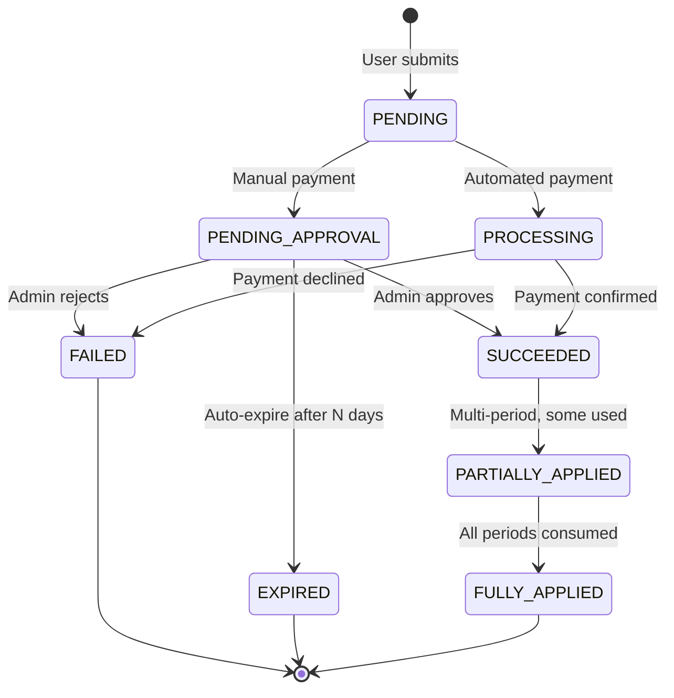
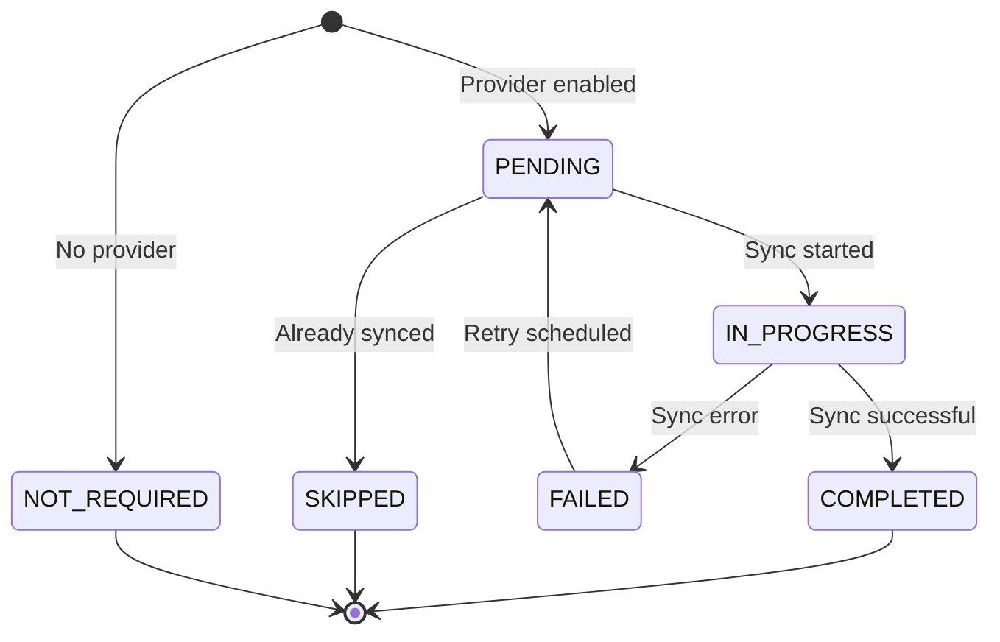
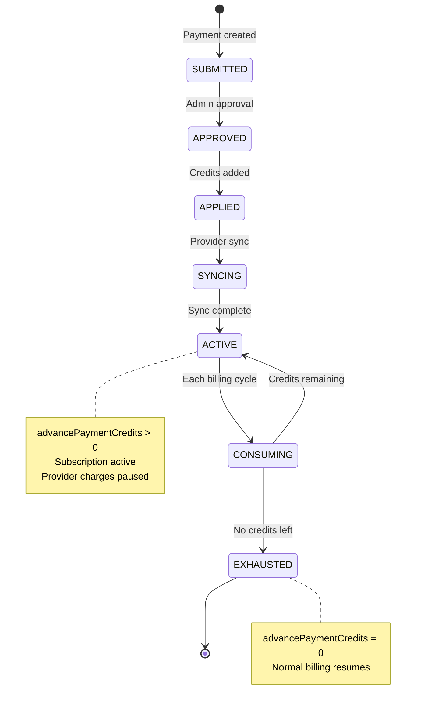

# Advance Payment Data Model & Sync Architecture Design

## Document Purpose
Detailed design of the data model, state management, and synchronization architecture for advance payment support in the manual payment system.

**Date**: 2026-08-31  
**Status**: Design Complete - Ready for Implementation

---

## Table of Contents
1. [Data Model Design](#data-model-design)
2. [State Machine](#state-machine)
3. [Sync Architecture](#sync-architecture)
4. [API Contracts](#api-contracts)
5. [Implementation Strategy](#implementation-strategy)

---

## Data Model Design

### 1. BillingPayment Schema Extensions

```prisma
model BillingPayment {
  id         String   @id @default(cuid())
  businessId String
  business   Business @relation(fields: [businessId], references: [id], onDelete: Cascade)

  // Provider identification (existing)
  provider      PaymentProvider
  paymentMethod PaymentMethod2
  
  // Payment details (existing)
  amount   Int    // cents
  currency String @default("PHP")
  status   PaymentStatus
  
  // Provider references (existing)
  providerTransactionId String?
  providerReference     String?
  providerMetadata      Json?
  
  // ========================================
  // NEW: Advance payment tracking
  // ========================================
  
  // Indicates if this payment covers multiple future periods
  isAdvancePayment      Boolean   @default(false)
  
  // Number of billing periods this payment covers (1 = single period, 3 = quarterly, etc.)
  periodsAdvancePaid    Int       @default(1)
  
  // When this advance payment was applied to the subscription
  // null = pending approval, non-null = applied
  advancePaymentAppliedAt DateTime?
  
  // When the last period covered by this advance payment expires
  // Calculated as: subscription.currentPeriodEnd + (periodsAdvancePaid * billingInterval)
  advancePaymentExpiresAt DateTime?
  
  // Period that this advance payment starts covering
  // Used to prevent overlapping advance payments
  coversPeriodStart     DateTime?
  coversPeriodEnd       DateTime?
  
  // ========================================
  // NEW: Provider synchronization
  // ========================================
  
  // Whether this payment has been synced to external provider (e.g., Stripe)
  syncedToProvider      Boolean   @default(false)
  
  // Which provider this was synced to (null if no sync needed)
  syncedProviderId      PaymentProvider?
  
  // When synchronization occurred
  syncedAt              DateTime?
  
  // Transaction/operation ID from provider after sync
  // For Stripe: subscription schedule ID or invoice item ID
  syncTransactionId     String?
  
  // Sync status and error tracking
  syncStatus            PaymentSyncStatus @default(NOT_REQUIRED)
  syncAttempts          Int               @default(0)
  lastSyncAttemptAt     DateTime?
  syncErrorMessage      String?
  
  // Relationships (existing)
  subscriptionId String?
  subscription   BusinessSubscription? @relation(fields: [subscriptionId], references: [id])
  
  // Existing fields...
  requiresApproval Boolean   @default(false)
  approvedAt       DateTime?
  approvedById     String?
  approvedBy       User?     @relation(fields: [approvedById], references: [id])
  rejectedAt       DateTime?
  rejectionReason  String?
  
  proofImageUrl String? @db.Text
  notes         String? @db.Text
  actorId       String?
  
  attempts BillingPaymentAttempt[]
  
  createdAt DateTime @default(now())
  updatedAt DateTime @updatedAt

  @@index([businessId, createdAt])
  @@index([provider, status])
  @@index([subscriptionId])
  @@index([status, syncStatus]) // NEW: Query pending syncs
  @@index([isAdvancePayment, advancePaymentExpiresAt]) // NEW: Query expiring advance payments
  @@map("billing_payments")
}

// NEW: Payment sync status enum
enum PaymentSyncStatus {
  NOT_REQUIRED  // No provider sync needed (manual-only mode)
  PENDING       // Approved, awaiting sync
  IN_PROGRESS   // Sync request in flight
  COMPLETED     // Successfully synced
  FAILED        // Sync failed, needs retry
  SKIPPED       // Deliberately skipped (e.g., already credited)
}
```

### 2. BusinessSubscription Schema Extensions

```prisma
model BusinessSubscription {
  id         String             @id @default(cuid())
  businessId String             @unique
  business   Business           @relation(fields: [businessId], references: [id], onDelete: Cascade)
  
  planId     String
  plan       SubscriptionPlan   @relation(fields: [planId], references: [id])
  status     SubscriptionStatus @default(TRIAL)
  
  // Billing model strategy (existing)
  billingModel BillingModel @default(MONTHLY_SUBSCRIPTION)
  
  // Billing period dates (existing)
  trialEndsAt        DateTime?
  currentPeriodStart DateTime?
  currentPeriodEnd   DateTime?
  
  // ========================================
  // NEW: Advance payment credit tracking
  // ========================================
  
  // Number of billing periods paid in advance
  // 0 = no advance credits, 3 = 3 periods paid ahead
  advancePaymentCredits Int       @default(0)
  
  // When the last advance-paid period expires
  // After this date, normal billing resumes (or grace period starts)
  advancePaymentExpiresAt DateTime?
  
  // Reference to the most recent advance payment
  lastAdvancePaymentId  String?
  lastAdvancePaymentAt  DateTime?
  
  // ========================================
  // NEW: Payment notification preferences
  // ========================================
  
  // Whether to send payment reminder notifications
  notifyBeforePayment   Boolean   @default(true)
  
  // Days before renewal to send first notification (default: 7)
  notificationLeadDays  Int       @default(7)
  
  // Last notification sent (prevent duplicates)
  lastNotificationSentAt DateTime?
  lastNotificationType   String?
  
  // ========================================
  // NEW: Provider sync metadata
  // ========================================
  
  // Tracks whether subscription has pending provider updates
  // Used to prevent race conditions during sync
  syncInProgress        Boolean   @default(false)
  lastSyncedAt          DateTime?
  
  // External provider reference (existing - already present)
  externalId String?
  
  // Lifecycle tracking dates (existing)
  gracePeriodEndsAt  DateTime?
  expiredAt          DateTime?
  longTermInactiveAt DateTime?
  cancelReason       String?
  
  // Timestamps (existing)
  activatedAt DateTime?
  cancelledAt DateTime?
  suspendedAt DateTime?
  
  // Relations (existing)
  statusHistory SubscriptionStatusHistory[]
  billingPayments BillingPayment[]
  notifications PaymentNotification[] // NEW relation
  
  createdAt DateTime @default(now())
  updatedAt DateTime @updatedAt

  @@index([businessId, status])
  @@index([advancePaymentExpiresAt]) // NEW: Query expiring subscriptions
  @@index([syncInProgress]) // NEW: Find subscriptions in sync
  @@map("business_subscriptions")
}
```

### 3. PaymentNotification Model (NEW)

```prisma
// NEW: Payment notification tracking
model PaymentNotification {
  id         String   @id @default(cuid())
  businessId String
  business   Business @relation(fields: [businessId], references: [id], onDelete: Cascade)

  subscriptionId String
  subscription   BusinessSubscription @relation(fields: [subscriptionId], references: [id], onDelete: Cascade)

  // Notification details
  notificationType PaymentNotificationType
  
  // When this notification should be sent
  scheduledFor     DateTime
  
  // When it was actually sent (null = not sent yet)
  sentAt           DateTime?
  
  // Payment details snapshot at notification creation
  dueDate      DateTime  // When payment is due
  amount       Int       // Amount to be charged (cents)
  billingPeriod String   // e.g., "Sep 1 - Sep 30, 2026"
  planName     String?   // e.g., "Premium"
  
  // Notification content
  title   String
  message String @db.Text
  
  // Delivery tracking
  status        PaymentNotificationStatus @default(SCHEDULED)
  failureReason String?
  retryCount    Int                       @default(0)
  maxRetries    Int                       @default(3)
  
  // Provider context (for provider-specific messaging)
  providerContext Json? // { provider: 'stripe', isAutomatic: true, etc. }
  
  createdAt DateTime @default(now())
  updatedAt DateTime @updatedAt

  @@index([businessId, scheduledFor])
  @@index([subscriptionId, scheduledFor])
  @@index([status, scheduledFor]) // Query pending notifications
  @@index([notificationType, status])
  @@map("payment_notifications")
}

// NEW: Notification type enum
enum PaymentNotificationType {
  UPCOMING_RENEWAL_7D    // 7 days before renewal
  UPCOMING_RENEWAL_3D    // 3 days before renewal
  UPCOMING_RENEWAL_1D    // 1 day before renewal
  ADVANCE_PAYMENT_EXPIRING // Advance credits running out
  MANUAL_PAYMENT_APPROVED  // Admin approved manual payment
  MANUAL_PAYMENT_REJECTED  // Admin rejected manual payment
  PAYMENT_FAILED           // Automated payment failed
  SUBSCRIPTION_EXPIRING    // No advance credits, subscription expiring
}

// NEW: Notification status enum
enum PaymentNotificationStatus {
  SCHEDULED   // Queued, not sent yet
  SENDING     // Currently being delivered
  SENT        // Successfully delivered
  FAILED      // Delivery failed
  CANCELLED   // Notification cancelled (e.g., payment made early)
  SKIPPED     // Deliberately skipped (e.g., duplicate)
}
```

### 4. Additional Enums

```prisma
// Payment status enum extension
enum PaymentStatus {
  PENDING
  PENDING_APPROVAL
  PROCESSING
  SUCCEEDED
  FAILED
  EXPIRED
  REFUNDED
  CANCELLED
  PARTIALLY_APPLIED    // Advance payment partially consumed
  FULLY_APPLIED        // NEW: Advance payment fully consumed
}
```

---

## State Machine

### Payment State Transitions



### Sync State Transitions



### Advance Payment Application State



---

## Sync Architecture

### Sync Service Interface

```typescript
/**
 * AdvancePaymentSyncService
 * 
 * Handles synchronization of manual advance payments with external providers.
 * Prevents duplicate charges and maintains consistency between local state
 * and provider state.
 */
export interface AdvancePaymentSyncService {
  /**
   * Sync approved advance payment to provider
   * 
   * For Stripe:
   * - Updates subscription metadata with advance payment info
   * - Creates subscription schedule to pause billing during advance period
   * - Or creates invoice credit to offset future charges
   * 
   * @param payment - The approved advance payment
   * @returns Sync result with transaction ID
   */
  syncAdvancePayment(payment: BillingPayment): Promise<SyncResult>

  /**
   * Check if provider should skip charge this period
   * 
   * Called by webhook handler before processing automated payment.
   * Returns true if advance credits cover this period.
   * 
   * @param subscription - The subscription being charged
   * @param periodStart - Start of billing period
   * @returns Whether to skip the charge
   */
  shouldSkipCharge(
    subscription: BusinessSubscription,
    periodStart: Date
  ): Promise<boolean>

  /**
   * Apply advance credits to subscription
   * 
   * Updates subscription record with advance payment details.
   * Calculates expiration date based on billing interval.
   * 
   * @param subscriptionId - Subscription to credit
   * @param payment - The advance payment
   * @returns Updated subscription
   */
  applyAdvanceCredits(
    subscriptionId: string,
    payment: BillingPayment
  ): Promise<BusinessSubscription>

  /**
   * Consume one period from advance credits
   * 
   * Called at each billing cycle to decrement credits.
   * Updates expiration date if needed.
   * 
   * @param subscriptionId - Subscription consuming credit
   * @returns Remaining credits
   */
  consumeAdvanceCredit(subscriptionId: string): Promise<number>

  /**
   * Retry failed sync
   * 
   * Background job calls this to retry failed syncs.
   * Implements exponential backoff.
   * 
   * @param paymentId - Payment with failed sync
   * @returns Retry result
   */
  retryFailedSync(paymentId: string): Promise<SyncResult>
}

export type SyncResult = {
  success: boolean
  syncTransactionId?: string
  syncedAt?: Date
  error?: string
  requiresRetry?: boolean
}
```

### Stripe-Specific Sync Implementation

```typescript
/**
 * StripeAdvancePaymentSync
 * 
 * Stripe-specific implementation of advance payment sync.
 */
export class StripeAdvancePaymentSync implements AdvancePaymentSyncService {
  
  private stripe: Stripe
  
  constructor(stripeClient: Stripe) {
    this.stripe = stripeClient
  }

  /**
   * Sync Strategy for Stripe:
   * 
   * 1. Update subscription metadata:
   *    - advancePaymentId: payment.id
   *    - advancePaymentExpiresAt: ISO date
   *    - advancePaymentCredits: number
   * 
   * 2. Create subscription schedule:
   *    - Pause billing during advance period
   *    - Resume after expiration
   * 
   * 3. Alternative: Create invoice credit
   *    - Credit amount = payment.amount
   *    - Applied automatically to future invoices
   */
  async syncAdvancePayment(payment: BillingPayment): Promise<SyncResult> {
    try {
      const subscription = await this.getSubscription(payment.subscriptionId)
      
      if (!subscription?.externalId) {
        throw new Error('No Stripe subscription found')
      }

      // Strategy 1: Update metadata + create schedule
      await this.stripe.subscriptions.update(subscription.externalId, {
        metadata: {
          advancePaymentId: payment.id,
          advancePaymentExpiresAt: payment.advancePaymentExpiresAt.toISOString(),
          advancePaymentCredits: payment.periodsAdvancePaid.toString(),
        },
      })

      // Create subscription schedule to pause billing
      const schedule = await this.stripe.subscriptionSchedules.create({
        from_subscription: subscription.externalId,
        phases: [
          {
            // Current phase: keep existing
            start_date: Math.floor(subscription.currentPeriodStart.getTime() / 1000),
            end_date: Math.floor(subscription.currentPeriodEnd.getTime() / 1000),
            items: [{ price: subscription.plan.stripePriceId }],
          },
          {
            // Pause phase: advance payment period
            start_date: Math.floor(subscription.currentPeriodEnd.getTime() / 1000),
            end_date: Math.floor(payment.advancePaymentExpiresAt.getTime() / 1000),
            items: [{ price: subscription.plan.stripePriceId }],
            billing_cycle_anchor: 'phase_start',
            // Pause billing by setting amount to 0 or removing items
            proration_behavior: 'none',
          },
          {
            // Resume phase: after advance payment expires
            start_date: Math.floor(payment.advancePaymentExpiresAt.getTime() / 1000),
            items: [{ price: subscription.plan.stripePriceId }],
            billing_cycle_anchor: 'phase_start',
          },
        ],
      })

      return {
        success: true,
        syncTransactionId: schedule.id,
        syncedAt: new Date(),
      }
      
    } catch (error) {
      console.error('[StripeSync] Error:', error)
      return {
        success: false,
        error: error instanceof Error ? error.message : 'Unknown error',
        requiresRetry: true,
      }
    }
  }

  async shouldSkipCharge(
    subscription: BusinessSubscription,
    periodStart: Date
  ): Promise<boolean> {
    // Check if advance credits cover this period
    if (subscription.advancePaymentCredits <= 0) {
      return false
    }

    // Check if period is within advance payment range
    if (!subscription.advancePaymentExpiresAt) {
      return false
    }

    return periodStart < subscription.advancePaymentExpiresAt
  }

  async applyAdvanceCredits(
    subscriptionId: string,
    payment: BillingPayment
  ): Promise<BusinessSubscription> {
    const subscription = await prisma.businessSubscription.findUnique({
      where: { id: subscriptionId },
      include: { plan: true },
    })

    if (!subscription) {
      throw new Error('Subscription not found')
    }

    // Calculate expiration date based on billing model
    const billingIntervalMonths = subscription.billingModel === 'YEARLY_SUBSCRIPTION' ? 12 : 1
    const periodsInMonths = payment.periodsAdvancePaid * billingIntervalMonths
    
    const currentEnd = subscription.currentPeriodEnd || new Date()
    const expiresAt = dayjs(currentEnd).add(periodsInMonths, 'month').toDate()

    // Update subscription with advance payment details
    return await prisma.businessSubscription.update({
      where: { id: subscriptionId },
      data: {
        advancePaymentCredits: payment.periodsAdvancePaid,
        advancePaymentExpiresAt: expiresAt,
        lastAdvancePaymentId: payment.id,
        lastAdvancePaymentAt: new Date(),
      },
    })
  }

  async consumeAdvanceCredit(subscriptionId: string): Promise<number> {
    const subscription = await prisma.businessSubscription.findUnique({
      where: { id: subscriptionId },
    })

    if (!subscription || subscription.advancePaymentCredits <= 0) {
      return 0
    }

    const newCredits = subscription.advancePaymentCredits - 1

    await prisma.businessSubscription.update({
      where: { id: subscriptionId },
      data: {
        advancePaymentCredits: newCredits,
        ...(newCredits === 0 && { advancePaymentExpiresAt: null }),
      },
    })

    return newCredits
  }

  async retryFailedSync(paymentId: string): Promise<SyncResult> {
    const payment = await prisma.billingPayment.findUnique({
      where: { id: paymentId },
      include: { subscription: true },
    })

    if (!payment) {
      return { success: false, error: 'Payment not found' }
    }

    // Exponential backoff: 5min, 15min, 30min, 1hr
    const backoffMinutes = [5, 15, 30, 60]
    const attempt = payment.syncAttempts
    const backoff = backoffMinutes[Math.min(attempt, backoffMinutes.length - 1)]
    
    const timeSinceLastAttempt = payment.lastSyncAttemptAt
      ? Date.now() - payment.lastSyncAttemptAt.getTime()
      : Infinity

    if (timeSinceLastAttempt < backoff * 60 * 1000) {
      return { success: false, error: 'Backoff period not elapsed', requiresRetry: true }
    }

    // Update attempt counter
    await prisma.billingPayment.update({
      where: { id: paymentId },
      data: {
        syncAttempts: attempt + 1,
        lastSyncAttemptAt: new Date(),
      },
    })

    // Retry sync
    return await this.syncAdvancePayment(payment)
  }

  private async getSubscription(subscriptionId?: string) {
    if (!subscriptionId) return null
    return await prisma.businessSubscription.findUnique({
      where: { id: subscriptionId },
      include: { plan: true },
    })
  }
}
```

---

## API Contracts

### 1. Submit Advance Payment

```typescript
// Request
type SubmitAdvancePaymentRequest = {
  planId: string
  periodsCount: number  // 1, 3, 6, 12
  paymentMethod: 'GCASH' | 'BANK_TRANSFER' | 'MAYA'
  referenceNo?: string
  notes?: string
  proofImageUrl: string
}

// Response
type SubmitAdvancePaymentResponse = {
  success: boolean
  paymentId?: string
  periodsGranted?: number
  totalAmount?: number
  expiresAt?: string  // ISO date
  message?: string
  error?: string
}

// Server Function
export const submitAdvancePayment = createServerFn({ method: 'POST' })
  .middleware([authMiddleware])
  .inputValidator(submitAdvancePaymentSchema)
  .handler(async ({ data, context }) => {
    const { user } = context
    
    // Calculate total amount
    const plan = await getPlan(data.planId)
    const totalAmount = plan.monthlyPrice * data.periodsCount
    
    // Create advance payment record
    const payment = await createAdvancePaymentRecord({
      businessId: user.businessId,
      planId: data.planId,
      periodsCount: data.periodsCount,
      amount: totalAmount,
      ...data,
    })
    
    return {
      success: true,
      paymentId: payment.id,
      periodsGranted: data.periodsCount,
      totalAmount,
      expiresAt: payment.advancePaymentExpiresAt?.toISOString(),
      message: `Payment submitted for ${data.periodsCount} period(s). Admin will review within 24 hours.`,
    }
  })
```

### 2. Review Advance Payment

```typescript
// Request
type ReviewAdvancePaymentRequest = {
  paymentId: string
  approved: boolean
  rejectionReason?: string
  applyImmediately?: boolean  // If false, schedule for next period
}

// Response
type ReviewAdvancePaymentResponse = {
  success: boolean
  message?: string
  subscription?: {
    creditsAdded: number
    newExpirationDate: string
    nextBillingDate: string
  }
  syncStatus?: {
    required: boolean
    completed: boolean
    provider?: string
  }
  error?: string
}

// Server Function
export const reviewAdvancePayment = createServerFn({ method: 'POST' })
  .middleware([authMiddleware, requirePermission(Permissions.BUSINESS_MANAGE_BILLING)])
  .inputValidator(reviewAdvancePaymentSchema)
  .handler(async ({ data, context }) => {
    const payment = await getPaymentWithSubscription(data.paymentId)
    
    if (data.approved) {
      // Apply advance credits
      const subscription = await advancePaymentService.applyAdvanceCredits(
        payment.subscriptionId,
        payment
      )
      
      // Sync to provider if needed
      let syncResult: SyncResult | null = null
      if (await shouldSyncToProvider(payment.businessId)) {
        syncResult = await advancePaymentSyncService.syncAdvancePayment(payment)
      }
      
      // Activate subscription if needed
      await activateSubscriptionIfNeeded(subscription, payment)
      
      // Send notification
      await notificationService.sendNow({
        businessId: payment.businessId,
        type: 'MANUAL_PAYMENT_APPROVED',
        title: 'Payment Approved',
        message: `Your advance payment for ${payment.periodsAdvancePaid} periods has been approved.`,
      })
      
      return {
        success: true,
        message: 'Payment approved and applied',
        subscription: {
          creditsAdded: payment.periodsAdvancePaid,
          newExpirationDate: subscription.advancePaymentExpiresAt!.toISOString(),
          nextBillingDate: subscription.currentPeriodEnd!.toISOString(),
        },
        syncStatus: syncResult ? {
          required: true,
          completed: syncResult.success,
          provider: payment.syncedProviderId || undefined,
        } : {
          required: false,
          completed: true,
        },
      }
    } else {
      // Reject payment
      await rejectPayment(data.paymentId, data.rejectionReason)
      
      return {
        success: true,
        message: 'Payment rejected',
      }
    }
  })
```

### 3. Get Payment Schedule

```typescript
// Response
type PaymentScheduleResponse = {
  currentSubscription: {
    planName: string
    status: string
    billingInterval: string
    currentPeriodEnd: string
  }
  advancePayment: {
    hasCredits: boolean
    creditsRemaining: number
    expiresAt?: string
    lastPaymentDate?: string
  } | null
  upcomingPayments: Array<{
    dueDate: string
    amount: number
    description: string
    status: 'advance_paid' | 'scheduled' | 'due_soon'
  }>
  paymentHistory: Array<{
    id: string
    date: string
    amount: number
    source: 'manual' | 'stripe' | 'other'
    status: string
    periodsCount: number
  }>
  notifications: {
    enabled: boolean
    leadDays: number
    lastSent?: string
  }
}

// Server Function
export const getPaymentSchedule = createServerFn({ method: 'GET' })
  .middleware([authMiddleware])
  .handler(async ({ context }) => {
    const { user } = context
    
    const subscription = await getSubscriptionWithPayments(user.businessId)
    const upcomingPayments = await calculateUpcomingPayments(subscription)
    const paymentHistory = await getPaymentHistory(user.businessId)
    
    return {
      currentSubscription: {
        planName: subscription.plan.name,
        status: subscription.status,
        billingInterval: getBillingIntervalLabel(subscription.billingModel),
        currentPeriodEnd: subscription.currentPeriodEnd!.toISOString(),
      },
      advancePayment: subscription.advancePaymentCredits > 0 ? {
        hasCredits: true,
        creditsRemaining: subscription.advancePaymentCredits,
        expiresAt: subscription.advancePaymentExpiresAt?.toISOString(),
        lastPaymentDate: subscription.lastAdvancePaymentAt?.toISOString(),
      } : null,
      upcomingPayments,
      paymentHistory,
      notifications: {
        enabled: subscription.notifyBeforePayment,
        leadDays: subscription.notificationLeadDays,
        lastSent: subscription.lastNotificationSentAt?.toISOString(),
      },
    }
  })
```

---

## Implementation Strategy

### Phase 1: Database Schema (Task #2)
1. ✅ Design complete
2. Add new fields to `BillingPayment` model
3. Add new fields to `BusinessSubscription` model
4. Create `PaymentNotification` model
5. Add new enums: `PaymentSyncStatus`, `PaymentNotificationType`, `PaymentNotificationStatus`
6. Run schema update (no migration per steering standards)

### Phase 2: Core Services (Tasks #3-5)
1. Update `ManualPaymentAdapter` to support `periodsAdvancePaid` parameter
2. Create `AdvancePaymentSyncService` interface
3. Implement `StripeAdvancePaymentSync` class
4. Update `SubscriptionEngine` to recognize advance credits
5. Update `reviewManualPayment` to apply credits and trigger sync

### Phase 3: Notification System (Task #6)
1. Create `PaymentNotificationService` class
2. Implement notification scheduling
3. Create background job for notification processing
4. Add notification templates

### Phase 4: UI (Tasks #7-10)
1. Update provider selection to always show manual option
2. Create advance payment submission form
3. Enhance admin review UI
4. Build payment schedule dashboard

### Phase 5: Integration (Tasks #11-12)
1. Update Stripe webhook handler
2. Add webhook checks for advance credits
3. Comprehensive testing
4. Edge case handling

---

## Success Metrics

### Data Integrity
- ✅ No orphaned advance credits
- ✅ Advance payment expiration dates calculated correctly
- ✅ Sync status accurately reflects provider state
- ✅ No duplicate charges during advance periods

### Performance
- ✅ Sync operations complete within 5 seconds
- ✅ Notification queries optimized with proper indexes
- ✅ No N+1 queries in payment schedule endpoint

### Reliability
- ✅ Failed syncs automatically retry
- ✅ Notifications sent reliably
- ✅ Edge cases handled gracefully
- ✅ Audit trail for all state changes

---

## Next Steps

1. ✅ Design document complete
2. 🔄 Proceed to Task #3: Update database schema
3. 📋 Begin implementation following phase plan

---

**Design Complete**: 2026-08-31  
**Ready for Implementation**: Yes ✅

